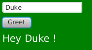

= Open-Dolphin Lazybones templates

These project templates make it very easy to create new Open-Dolphin applications.

== Installation of Lazybones using gvm (Linux, OS/X)

Install gvm:

-----------
$ curl -s get.gvmtool.net | bash
-----------

Install lazybones:

-----------
$ gvm install lazybones
-----------

Add the following entry to your +$HOME/.lazybones/config.groovy+ file
(create the file if it isn't there):

-----------
bintrayRepositories = [
    "opendolphin/lazybones-templates"
]
-----------

== Installation of Lazybones without gvm
Grab the distribution from https://bintray.com/pkg/show/general/pledbrook/lazybones-templates/lazybones[Bintray], unpack it to a local directory, and then add its +bin+ directory to your PATH environment variable.

== Usage

The Open-Dolphin templates are comprised of a main template which creates a multi-module gradle project and several subtemplates. You can choose whether your project should be java or groovy based. You may also choose which technology you would like to use. Currently there is a subtemplate for JavaFX and a HTML5 frontend
is included in the _server_ submodule. Here is a list of all currently available subtemplates:

* dolphin-shared-java
* dolphin-server-java
* dolphin-client-javafx-java
* dolphin-combined-java
* dolphin-server-webapp
* dolphin-shared-groovy
* dolphin-server-groovy
* dolphin-client-javafx-groovy
* dolphin-combined-groovy

The following sections will help you to setup a new Open-Dolphin project. You will end up with a simple hello world GUI connected to the server.

=== Run Main Template
In an arbitrary directory execute +lazybones create open-dolphin hello_dolphin+ which will create the folder +hello_dolphin+ and expand the template into it.
Confirm the questions for _group_, _version_ and _packageName_ with the +enter+ key or give it the values you like.
Then cd into the _hello_dolphin_ folder and you should see the familiar files of a gradle based project:

[source,shell]
----
build.gradle
gradle
gradle.properties
gradlew
gradlew.bat
LICENSE
README.adoc
settings.gradle
setup_for_groovy.sh #<1>
setup_for_java.sh #<2>
----

Next we need to setup the folders for the _client_, _server_, _combined_, _shared_ and _webapp_ modules. The shell scripts
[conum,data-value=1]_1_ and [conum,data-alue=2]_2_ will help you to make this in one go.

=== Run Subtemplates

if you would like to work in java call +setup_for_java.sh+. For groovy call +setup_for_groovy.sh+. This will create five new folders for the submodules:

[source,shell]
----
build.gradle
client #<1>
combined #<2>
gradle
gradle.properties
gradlew
gradlew.bat
LICENSE
README.adoc
server #<3>
settings.gradle
setup_for_groovy.sh
setup_for_java.sh
shared #<4>
webapp #<5>
----

== Running the application

You can run the application in two modes: the _development_ mode and the _remote_ mode.

=== Development mode

To run it in _development_ mode invoke:

-----
	./gradlew :combined:run
-----

which shows the hello dolphin GUI with an entry field for the name and _Greet_ button on it. Clicking the button will show a _Hey Duke_ greeting:

On the terminal you can watch the commands which are sent forth and back between client and server.

=== Remote mode

To run it in _remote_ mode invoke:

-----
	./gradlew jettyRun
-----

and in a second terminal

-----
	./gradlew :client:run
-----

Note that the client and the server communication messages now appear in the client respectively server terminal.

=== HTML5 Frontend

If you would like to develop a HTML5 frontend the project template comes with an example in form of a JSP: +webapp/src/main/webapp/hellodolphin.jsp+
which you can use as a start. To try it out start jetty as described in the _remote mode_ :
-----
	./gradlew jettyRun
-----

And then point your browser to http://localhost:8080/appContext/hellodolphin.jsp which will show a page which looks very similar to the JavaFX GUI we
already saw:

image::doc/hello_dolphin_html5.png[]

== IDEs

=== IntelliJ IDEA

IntelliJ IDEA users simply choose +File/Import Project+ from the menu bar and then select +hello_dolphin/build.gradle+. This will open the _Import Project from Gradle_ dialog. Having confirmed the dialog you are ready to go. To run the application open +ApplicationInMemoryStarter+ from +combined/src/main/java...+ and run it. This corresponds to
+./gradlew :combined:run+ which we performed earlier on the commandline.

=== Netbeans 8
I am an IntelliJ IDEA user and unfortunately could not quite figure out how to import the gradle based project into Netbeans. If anyone has some hints on how to
do it properly please let me know. This is what I found so far:
Netbeans 8 users need to install the _Gradle Support_ plugin via +Tools/Plugins+. After restarting the IDE simply choose +File/Open Project+ from the menu bar and then select the +hello_dolphin+ folder which already carries the _gradle_ icon. At this point unfortunately Netbeans complains that it cannot find the _:shared_ module although it
works on the commandline and in IntelliJ IDEA.

=== Eclipse
In the +hello_dolphin+ folder invoke +./gradlew eclipse+. Start Eclipse and choose +File/Import+ from the menu bar and then +General/Existing Projects into Workspace+. Then select +hello_dolphin+ as the root directory and make sure to have selected the _Search for nested projects_ checkbox:

image::doc/eclipse_import_project_1.png[]

Press the _Finish_ button, open +ApplicationInMemoryStarter+ from the _combined_ project and run it. This should bring up the familiar Hello Dolphin GUI.

Note that if you are not using JDK 8 but JDK 7 you might need to add the JavaFX jar +JAVA_HOME/jre/lib/jfxrt.jar+ to your classpath.

=== Conclusion

Now you have a running Open-Dolphin project setup which you can use to develop your application.
For more information have a look at the http://open-dolphin.org/[Open-Dolphin webpage] and the Jumpstart tutorial at https://github.com/canoo/DolphinJumpStart[DolphinJumpStart]

== Additional Information

=== Subtemplates
Instead of using the convenience scripts +setup_for_java.sh+ and +setup_for_groovy.sh+ you can also apply the subtemplates individually. In fact
the scripts do just that. To invoke the java/javafx template alone simply call:

-----
lazybones generate dolphin-server-java
-----
If you would like to pass the value for _moduleName_ on the commandline use the +-P+ parameter:
-----
lazybones generate -PmoduleName=server dolphin-server-java
-----

In case something went wrong during the application of the template setting the loglevel might help:
-----
lazybones --logLevel=FINE  generate -PmoduleName=server dolphin-server-java
-----

=== Using top level templates
Note that there is an alternative way to generate the Open Dolphin project structure which uses just top level templates for all the described technology / language combinations described. Currently it is still exeprimental but will most likely become the way to generate the project structure. Subtemplates will then be used to
generate patterns like PMs for table handling etc. into the individual folders.

To use the top-level templates we recommend to create a new empty directory and then inside it you use lazybones to create
the individual projects (replace java with groovy for the groovy version):

* lazybones create dolphin-shared-java shared
* lazybones create dolphin-server-java server
* lazybones create dolphin-client-javafx-java client
* lazybones create dolphin-combined-java combined
* lazybones create dolphin-server-webapp webapp

For the first time we recommend to do it exactly like this, have a look at the +settings.gradle+ and +build.gradle+ files to see how they depend on each other. If necessery you can then adjust the dependencies according to your needs.

Note that this way it is possible to have the individual project folders in any location you like. Technically each project is a multi module project and you can import each of them into your IDE where the dependent projects appear as well.

=== Other Open-Dolphin Templates

* https://github.com/canoo/open-dolphin-lazybones-templates/doc/gwt.adoc[Open-Dolphin GWT Template]

=== Template Development Instructions

* Make a change in a template, e.g. +templates/subtmpl-dolphin-client-javafx-java+
* In the top folder execute +./gradlew installTemplateOpenDolphin+ which will install the +opendolphin+ template into +~/.lazybones/templates/opendolphin-0.0.6.zip+
* In an arbitrary directory execute +lazybones create opendolphin 0.0.6 hello_dolphin+ which will create the folder +hello_dolphin+ and expand the template into it.
* Repeat the previous steps until you are satisfied with the result

== Publishing
* In the top level folder invoke +./gradlew publishTemplateOpenDolphin+ . Note: the first time a package needs to be created with the bintray Web-GUI in the 'lazybones-templates' repository with a name ending in '-template' (for this example 'open-dolphin-template').

